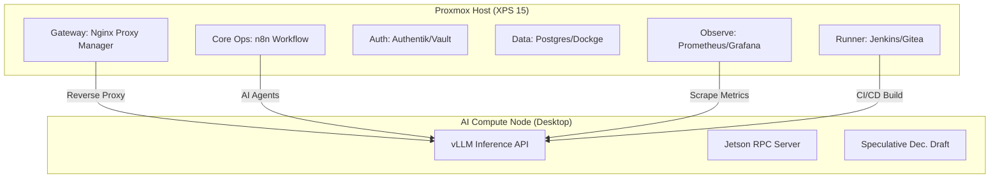

# Integration Plan: AI IDP + Active Production System
**Date**: January 12, 2026

## Goal
Integrate the new **AI Compute Node** (Perplexity-Labs-003) with the existing **Active Production System** (Proxmox LXC Cluster) to providing a unified AI Intelligent Development Platform.

## Architecture Topology

## Integration Points

### 1. Network Integration (Gateway)
- **Objective**: Expose AI API to internal LXC network securely.
- **Action**: Add Proxy Host in Nginx Proxy Manager (LXC 1).
- **Config**:
  - Domain: `ai.schlimers.internal` -> `http://<AI_DESKTOP_IP>:8000`
  - Auth: Authentik (LXC 3) middleware for access control.

### 2. Workflow Automation (Core Ops)
- **Objective**: Enable n8n (LXC 2) to use local LLMs.
- **Action**: Add "HTTP Request" node credentials in n8n.
- **Config**:
  - Base URL: `http://ai.schlimers.internal/v1`
  - Header: `Authorization: Bearer <API_KEY_FROM_SECRETS>`

### 3. CI/CD Pipeline (Runner)
- **Objective**: Use LLMs for code review in Jenkins/Gitea (LXC 6).
- **Action**: Configure webhook triggered pipeline.
- **Flow**: Gitea PR -> Jenkins -> REST Call to `ai.schlimers.internal` -> "Review this diff" -> Post comment back to Gitea.

### 4. Observability (Observation)
- **Objective**: Monitor GPU metrics in central Grafana (LXC 5).
- **Action**: Add AI Desktop as Prometheus target.
- **Config**:
  - Scrape Config: `sys-metrics` from `jetson-exporter` and valid `vllm` metrics endpoint.

## Implementation Steps

### Phase 1: Network Bridge
- [ ] Assign static IP to AI Desktop (e.g., `192.168.1.50`).
- [ ] Configure NPM in LXC 1 to point to `192.168.1.50:8000`.

### Phase 2: Service Verification
- [ ] Test n8n connectivity to vLLM.
- [ ] Test Prometheus scraping of AI metrics.

### Phase 3: "Intelligence Injection"
- [ ] Create "Code Review Agent" workflow in n8n.
- [ ] Connect Jenkins pipeline to Agent.

## Verification
- **Manual**: Trigger manual n8n workflow using Llama 3.1 8B.
- **Automated**: Jenkins job "Hello World" that requests an AI poem.
